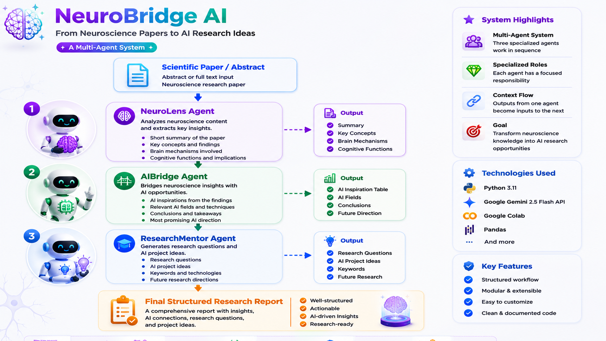
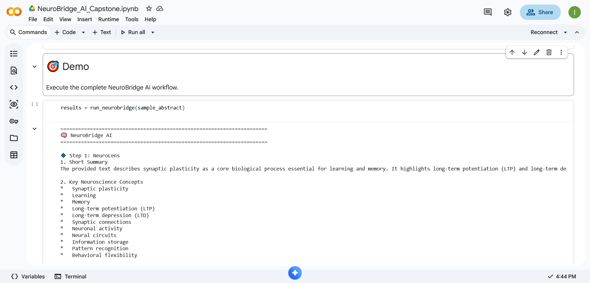
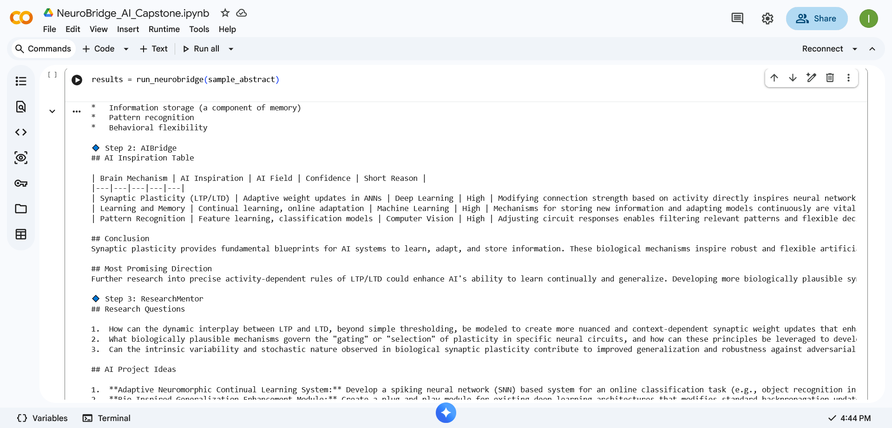

# 🧠 NeuroBridge AI Agent

> **From Neuroscience Papers to AI Research Ideas**

Google AI Agents Intensive Capstone Project (2026)



---

# Overview

NeuroBridge is a multi-agent AI system that transforms neuroscience literature into structured AI research ideas.

Instead of only summarizing scientific papers, NeuroBridge builds a reasoning pipeline where specialized AI agents collaborate sequentially to:

- Understand neuroscience research
- Extract biological knowledge
- Connect findings to AI applications
- Generate future research directions

The goal is to bridge neuroscience discoveries with artificial intelligence innovation.

---

# Problem

Scientific papers contain valuable knowledge, but extracting meaningful insights and converting them into actionable AI research ideas is difficult and time-consuming.

NeuroBridge automates this process using a collaborative Multi-Agent architecture.

---

# Architecture

NeuroBridge consists of three specialized AI agents that work sequentially.

## 🧠 NeuroLens Agent

Analyzes neuroscience papers and extracts:

- Paper summary
- Key neuroscience concepts
- Biological mechanisms
- Brain regions
- Cognitive functions

↓

## 🤖 AIBridge Agent

Transforms neuroscience findings into AI opportunities by generating:

- AI inspiration table
- Related AI fields
- Conclusions
- Most promising AI direction

↓

## 🎓 ResearchMentor Agent

Generates:

- Research questions
- AI project ideas
- Recommended keywords
- Future research directions

↓

Final Output:

A structured research report combining all agent outputs.

---

# Technologies

- Python
- Google Gemini 2.5 Flash
- Google Colab
- Multi-Agent Prompt Engineering

---

# Key Features

- Multi-Agent workflow
- Modular architecture
- Structured scientific analysis
- AI research idea generation
- Secure API handling using Colab Secrets
- Extensible design

---

# Course Concepts Demonstrated

This project demonstrates multiple concepts from the Google AI Agents Intensive course:

✅ Multi-Agent Architecture

✅ Sequential Agent Collaboration

✅ Prompt Engineering

✅ Structured LLM Outputs

✅ Modular Agent Design

---

# Demo

## Workflow Execution

The following screenshots demonstrate the execution of the complete NeuroBridge pipeline.

### Agent Workflow



### Generated Research Output



---

# Repository Structure

```
NeuroBridge-AI-Agent/
│
├── NeuroBridge_AI_Capstone.ipynb
├── README.md
├── architecture.png
├── demo1.png
└── demo2.png
```

---

# Future Improvements

- PDF upload support
- PubMed integration
- Retrieval-Augmented Generation (RAG)
- MCP integration
- Streamlit interface
- Deployment as a web application

---

# Setup

Clone the repository:

```bash
git clone https://github.com/arianacloud/NeuroBridge-AI-Agent.git
```

Install dependencies:

```bash
pip install google-generativeai pandas
```

Add your Gemini API Key using Google Colab Secrets.

Run the notebook:

```
NeuroBridge_AI_Capstone.ipynb
```

---

# Author

**Ariana**

Google AI Agents Intensive Capstone Project (2026)

GitHub:
https://github.com/arianacloud
